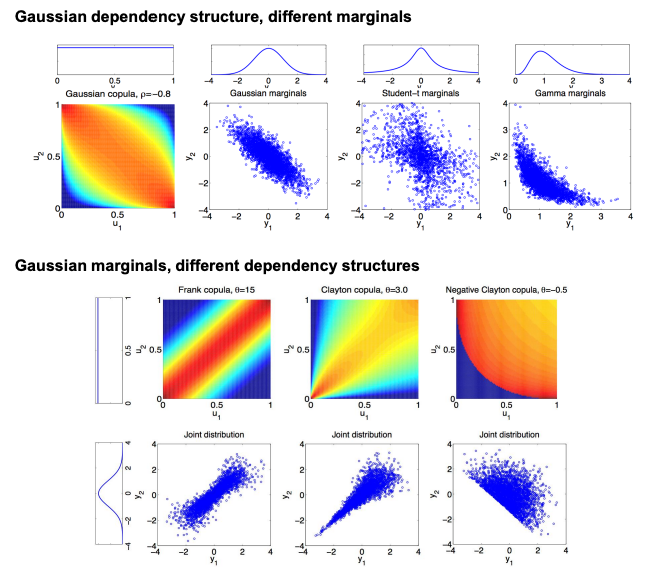

# empirical_copula

`empirical_copula` is a Python library to compute and plot 2D empirical copulas of discrete 
data (ordinal or categorical).

## What is an empirical copula? 

A copula is a statistical object that captures the dependencies between two random variables, 
independently of their marginal distribution. For instance, as in the figure below, two 
variables might be dependent only in their low tails (Fig. 1).

Statisticians have defined parametric families of copulas that describe different kind of 
dependencies between continuous variables (Fig. 2). 

An empirical copula visualizes the dependency structure observed in samples from two random 
variables. 

For discrete (or discretized) variables, the empirical copula shows on the two axes the 
cumulative observed frequency of the values of each variable. The values in the copulas is the 
empirical joint pmf in that space. Independent variables in the copula space have uniform 
probability, and so the values in the copula can be interpreted as deviations from independence.

## An example

An example is going to make this much clearer. Figure 3 shows the log empirical copula between a 
quality score and house price from the `house_price` OpenML dataset.

The spacing of the lines on the axes show the frequencies of the values of the two variables. 
Since the area of each combination of values is the product of the frequency, independent 
variables would have a uniform probability of 1.0 in each of the cases, or 0.0 in logarithmic 
space.

The value of ~0.5 for the pair (quality=7, price=225k) means that that pair has been observed 
10^0.5 ~= 3.2 times more often than one would expect in independent variables. This examples 
demonstrates a strong dependencies between the quality score and the hose price, especially in 
the high and low tails of extreme high and low quality and prices, which are observed 10x more 
often than in the uniform case. 

## Statistical significance

We evaluate the statistical significance of the observed deviations from independence using 
bootstrapping: we destroy the dependencies between the variables by resampling them replacement
independently from each other. Doing this many times gives us an estimate of the distribution 
of the frequencies we would observe with the same marginal distribution if the variables were 
independent. We can then look at how extreme what we observe is compared to this null-hypothesis 
distribution and derive a significance level.

## Examples

To learn how to use `emipirical_copula`, it's easiest to look at the examples notebook in the
git repository: [GitHub examples notebooks](https://github.com/pberkes/empirical_copula/tree/main/examples)

## References

- Figure 1:
Cosyne08 abstract and poster: Berkes, P., Pillow, J., and Wood, F. (2008).
Characterizing neural dependencies with Poisson copula models. Cosyne 2008, Salt Lake City (abstract).

- Figure 2:
Berkes, P., Wood, F., and Pillow, J. (2009).
Characterizing neural dependencies with copula models. Advances in Neural Information Processing Systems, 21.
